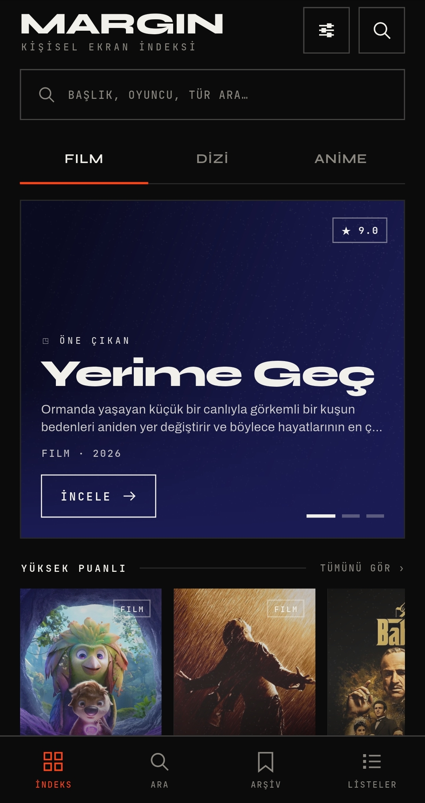
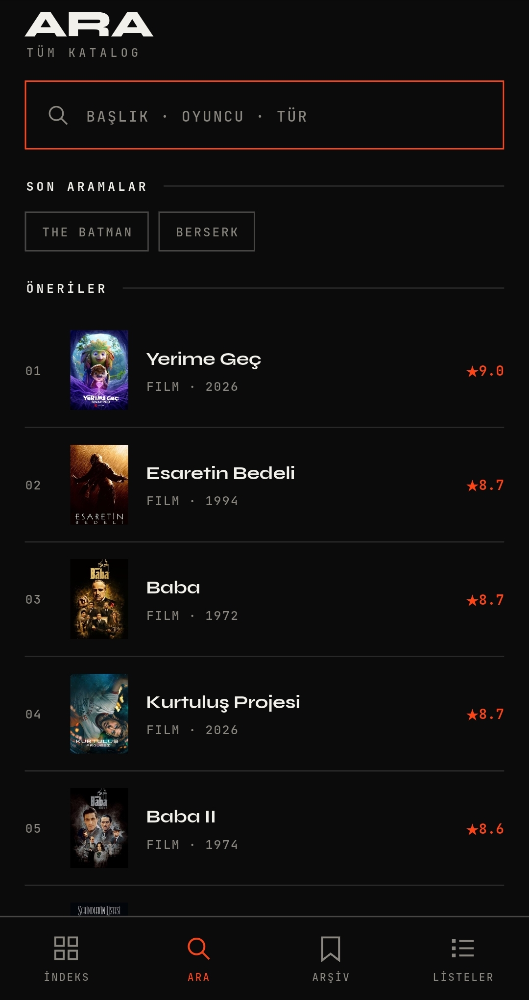
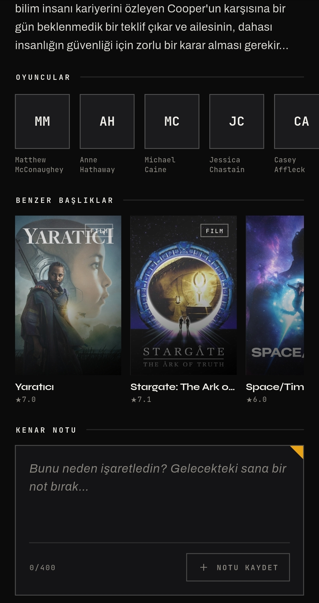
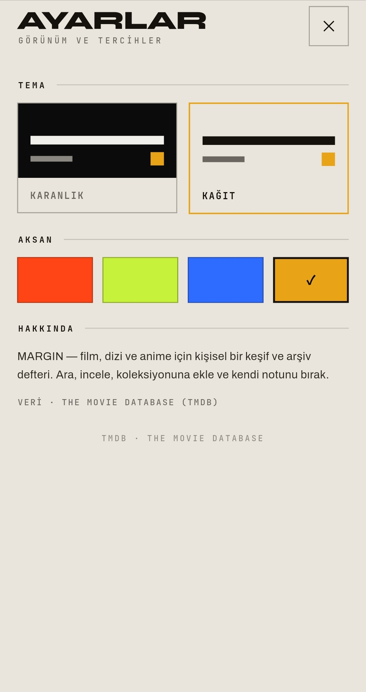
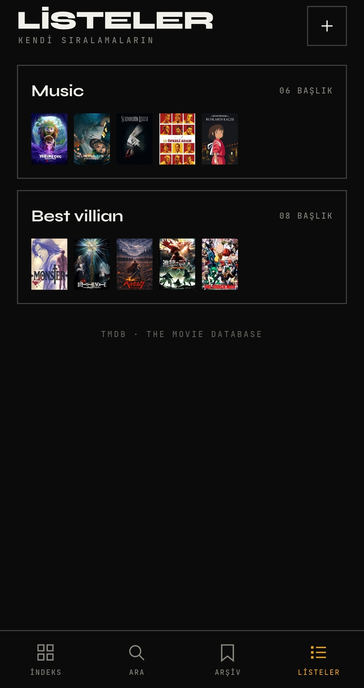
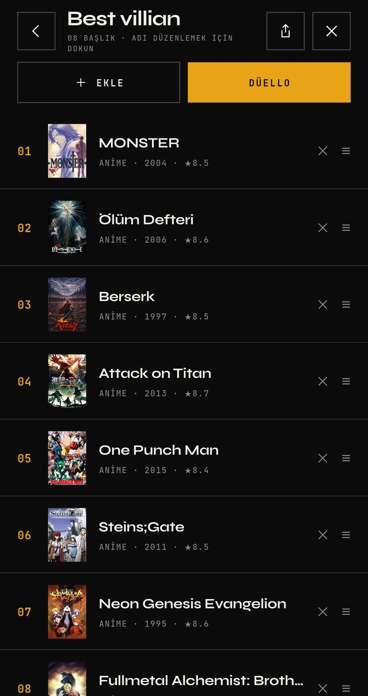

# MARGIN

A movie / TV / anime explorer built with **Flutter**, powered by the **TMDB API**.
Editorial, brutalist UI with a personal twist: save titles to your archive and leave a
"margin note" on each one.

> Course project for *Mobile Application Development (Flutter)*.

## Screens

<p align="center">
  
  
  
</p>
<p align="center">
  
  
  
</p>
<p align="center"><sub>Index · Search · Detail (margin note) &nbsp;&nbsp;|&nbsp;&nbsp; Settings · Lists · List detail + duel</sub></p>

## Features

- Browse top-rated **films, TV shows and anime** (TMDB), with **pull-to-refresh**
  and **infinite scrolling**.
- **Search** by title, cast or genre, with recent-search history.
- **Detail** page: synopsis, cast, genres, rating, a YouTube **trailer**, a
  **"similar titles"** rail, and an editable **margin note**.
- **Archive**: your saved collection, stored locally.
- **Lists**: build your own ranked lists, each entry a title plus an optional
  label (rank *best anime villains* by pairing posters with names). Order them
  by hand, or with a **duel** ("which is better?") that ranks the whole list
  for you. Add titles by name, by category/genre, or from your archive.
- **Share** a list or a note as an editorial image card.
- **Dark / Paper** themes with a selectable accent color.
- Loading, error and empty states; offline cache; animations.

## Tech

Flutter · Provider (state) · Hive (local storage) · `http` (REST) ·
`cached_network_image` · `palette_generator` · `google_fonts` · `intl` ·
`url_launcher` (trailers) · `share_plus` + `path_provider` (image export).

## Getting started

This app needs a free **TMDB API key (v3 auth)** — get one at
<https://www.themoviedb.org/settings/api>.

The key is **not** committed to the repo; pass it at runtime:

```bash
flutter pub get
flutter run --dart-define=TMDB_KEY=your_key_here
```

> The code reads the key via `String.fromEnvironment('TMDB_KEY')`.

## Testing

Unit tests cover the data models (TMDB parsing, meta strings, JSON round-trips
for media items and ranked lists), the archive (`SavedProvider`) and lists
(`ListsProvider`), theme persistence (`ThemeProvider`), the **duel ranking**
algorithm (`DuelRanker`), plus a boot smoke test. They use a temp-dir Hive box
and need no network or API key:

```bash
flutter test
flutter analyze
```

## Notes

- **Anime** is not a separate TMDB category, so it's modeled as TV filtered to
  Japanese-origin animation; genre filtering is applied client-side by name.
- TMDB ships no dominant color, so each title's is extracted from its poster at
  runtime (`palette_generator`) and cached, feeding the heroes and color-fields.
- **Lists & duel.** Lists store full title snapshots in rank order. The duel
  ranks a list with a bottom-up merge sort exposed as a one-question-at-a-time
  state machine (`DuelRanker`): ~n·log2(n) "A or B?" choices yield a *fully*
  sorted result — unlike a single-elimination bracket, which only reliably
  crowns the winner.
- **Sharing** rasterizes an editorial card via `RepaintBoundary` and hands the
  resulting PNG to the OS share sheet.

## Project structure

```
lib/
  theme/      design tokens, palettes, typography
  models/     MediaItem, CastMember, SavedEntry, RankList, genre maps
  services/   TMDB REST client, Hive storage, palette cache
  providers/  theme, catalog, saved, search, lists state
  utils/      formatting + the duel ranking algorithm
  widgets/    reusable UI pieces (poster, hero, chips, share card, states…)
  screens/    browse, search, detail, saved, settings, lists, list detail, duel
```
